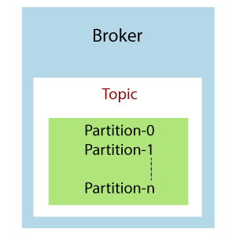

## Kafka Topics
- **Definition**: A topic is a category or feed name to which records (messages) are published in Kafka.
- **Purpose**: Topics are used to organize and categorize the data being sent through Kafka. Each topic can have multiple producers (sending data) and consumers (reading data).
- **Example**: If you have a messaging system for a ride-hailing app, you might have different topics like ride-requests, driver-updates, and user-notifications.

## Kafka Broker
- **Definition**: A broker is a server that stores and serves the data within Kafka.
- **Purpose**: Brokers handle the requests from producers and consumers. They manage the storage of data in topics and ensure the messages are available for consumers to read.
- **Example**: In a ride-hailing app, the broker would manage the topics related to ride requests, storing all the incoming requests from users and making them available for processing by drivers.

