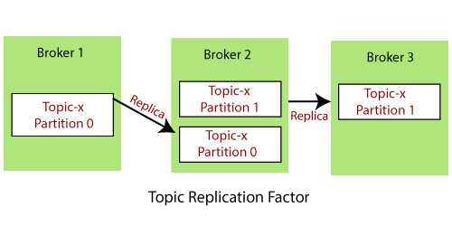

## What is Topic Replication?
- **Definition**: Topic replication refers to the process of duplicating the messages of a Kafka topic across multiple brokers in a Kafka cluster.
- **Purpose**: It provides fault tolerance and high availability. If one broker fails, the messages are still accessible from another - broker that has a replica of that topic.

For example, suppose we have a cluster containing three brokers say Broker 1, Broker 2, and Broker 3. A topic, namely Topic-X is split into Partition 0 and Partition 1 with a replication factor of 2.

