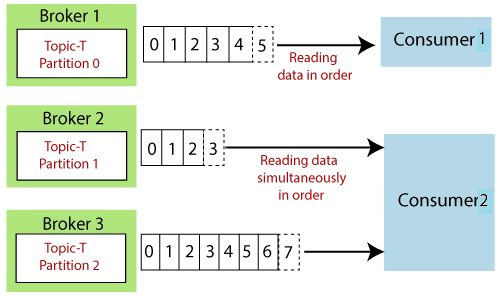
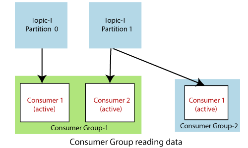

# Kafka: Consumer and Consumer Groups

## Overview

In Apache Kafka, consumers are applications that read and process data from Kafka topics. They can work individually or as part of consumer groups to improve performance and scalability.

## Kafka Consumer

- A **consumer** subscribes to one or more Kafka topics and reads the messages produced to those topics.
- Each consumer can process messages independently.

## Consumer Groups

- A **consumer group** is a collection of one or more consumers that work together to consume messages from topics.
- Each message is delivered to only one consumer within the group, enabling load balancing and parallel processing.

  
### Benefits of Consumer Groups

1. **Scalability**: You can increase the number of consumers to handle more data efficiently.
2. **Load Balancing**: Messages are distributed among consumers, ensuring optimal resource usage.
3. **Fault Tolerance**: If one consumer fails, others in the group can take over and continue processing.

## Conclusion

Understanding Kafka consumers and consumer groups is crucial for building efficient, scalable applications that process large volumes of data in real-time.
