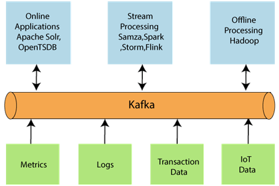
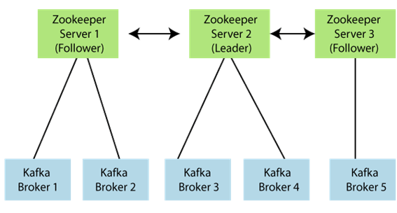
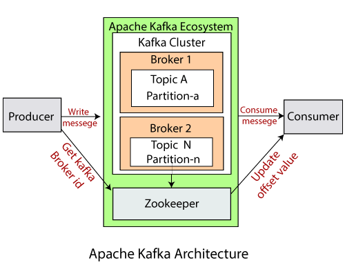

## Apache Kafka Architecture
We have already learned the basic concepts of Apache Kafka. These basic concepts, such as Topics, partitions, producers, consumers, etc., together forms the Kafka architecture.

As different applications design the architecture of Kafka accordingly, there are the following essential parts required to design Apache Kafka architecture.

1. **Data Ecosystem**: Several applications that use Apache Kafka forms an ecosystem. This ecosystem is built for data processing. It takes inputs in the form of applications that create data, and outputs are defined in the form of metrics, reports, etc. The below diagram represents a circulatory data ecosystem for Kafka.

2. **Kafka Cluster**: A Kafka cluster is a system that comprises of different brokers, topics, and their respective partitions. Data is written to the topic within the cluster and read by the cluster itself.

3. **Producers**: A producer sends or writes data/messages to the topic within the cluster. In order to store a huge amount of data, different producers within an application send data to the Kafka cluster.

4. **Consumers**: A consumer is the one that reads or consumes messages from the Kafka cluster. There can be several consumers consuming different types of data form the cluster. The beauty of Kafka is that each consumer knows from where it needs to consume the data.

5. **Brokers**: A Kafka server is known as a broker. A broker is a bridge between producers and consumers. If a producer wishes to write data to the cluster, it is sent to the Kafka server. All brokers lie within a Kafka cluster itself. Also, there can be multiple brokers.

6. **Topics**: It is a common name or a heading given to represent a similar type of data. In Apache Kafka, there can be multiple topics in a cluster. Each topic specifies different types of messages.

7. **Partitions**: The data or message is divided into small subparts, known as partitions. Each partition carries data within it having an offset value. The data is always written in a sequential manner. We can have an infinite number of partitions with infinite offset values. However, it is not guaranteed that to which partition the message will be written.

8. **ZooKeeper**: A ZooKeeper is used to store information about the Kafka cluster and details of the consumer clients. It manages brokers by maintaining a list of them. Also, a ZooKeeper is responsible for choosing a leader for the partitions. If any changes like a broker die, new topics, etc., occurs, the ZooKeeper sends notifications to Apache Kafka. A ZooKeeper is designed to operate with an odd number of Kafka servers. Zookeeper has a leader server that handles all the writes, and rest of the servers are the followers who handle all the reads. However, a user does not directly interact with the Zookeeper, but via brokers. No Kafka server can run without a zookeeper server. It is mandatory to run the zookeeper server.

Note: With Kafka version 0.10 and above, a Zookeeper does not store the consumer offset value. It is stored in the Kafka topics (as seen in Kafka topics section).

Hence, on combining all the necessities, a Kafka cluster architecture is designed.
